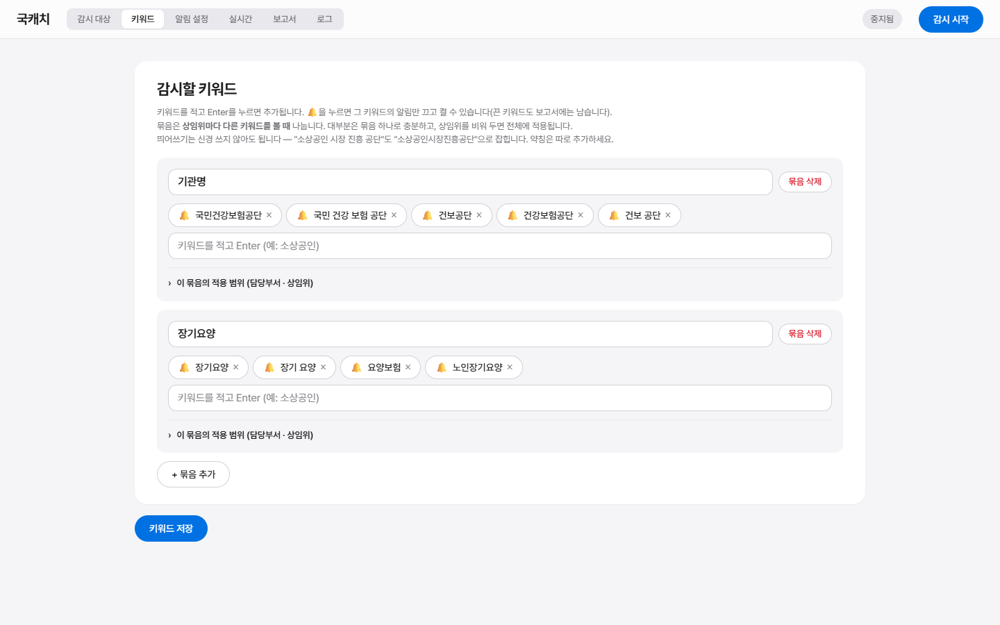
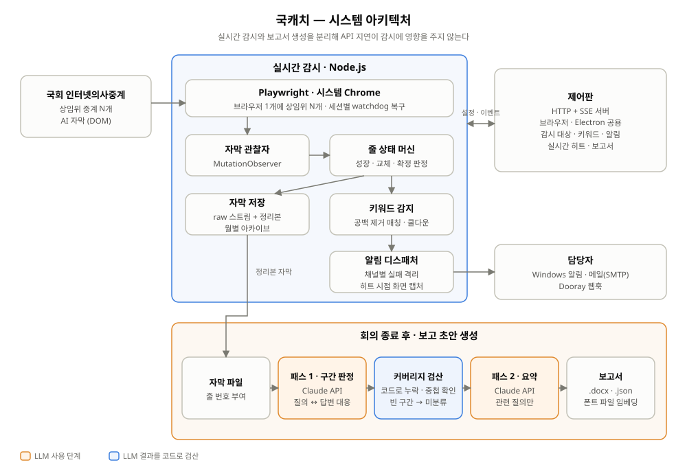

# 국캐치 (Gukcatch)

국회 인터넷의사중계시스템의 **AI 자막을 실시간으로 감시**해 우리 기관 관련
발언을 놓치지 않고, 회의가 끝나면 **보고 초안을 자동으로 만들어 주는 도구**입니다.

담당자 한 명이 상임위 하나를 붙잡고 앉아 받아쓰던 일을, PC 한 대가 여러
상임위를 동시에 지켜보는 것으로 바꿉니다.

```
국회 중계 화면 ──▶ 자막 캡처 ──▶ 키워드 감지 ──▶ 알림 (🔔 Windows·메일·Dooray)
                        │
                        └──▶ 회의 종료 후 ──▶ 보고 초안 (.docx / .json)
```

| 질의·답변 매칭 커버리지 | 정규식 방식 대비 | 동시 감시 |
|:---:|:---:|:---:|
| **100%** (실제 국방위 회의) | 누락 **2/3 → 0건** | 상임위 **N개 / PC 1대** |



---

## 문제 정의: 만들지 않을 것부터 정했다

현장에서는 직원이 이어폰 한쪽으로 국회 중계를 들으며 다른 업무를 병행했고,
인턴은 화면의 AI 자막을 눈으로 보며 그대로 받아 적고 있었다. 그런데 확인해 보니
**국회 사이트가 회의가 끝난 뒤 AI 자막 전문을 이미 올려주고 있었다.**
자막을 텍스트로 저장하는 기능만으로는 가치가 없다는 뜻이다.

그래서 기능을 추가할 때마다 **"사이트에 사후로 올라오는 텍스트로도 되는 일인가?"** 를 먼저 물었고,
된다면 만들지 않았다. 남은 것은 사후 텍스트가 구조적으로 할 수 없는 네 가지였다.

| 사후 텍스트로 안 되는 것 | 국캐치가 하는 일 |
|---|---|
| **실시간성**: 국정감사 대응은 회의가 끝나면 이미 늦다 | 키워드가 나오는 즉시 알림 |
| **선별**: 전문이 있어도 우리 기관 관련 부분은 사람이 찾아야 한다 | 기관명·약칭 키워드 묶음 |
| **가공**: 발췌한 텍스트는 보고서가 아니다 | 질의·답변 단위로 보고 초안 작성 |
| **동시성**: 사람은 상임위 하나만 들을 수 있다 | 여러 상임위를 동시에 감시 |

## 가설 → 검증

| 가설 | 결과 | 결정 |
|---|---|---|
| 질의와 답변은 규칙(정규식)으로 나눌 수 있다 | 실제 국방위 데이터에서 질의 3건 중 **2건의 답변을 찾지 못함**. 여러 위원이 연달아 질의하고 정부 측이 한 번에 답하는 진행 방식 때문 | LLM이 구간을 판정하는 **2단계 방식**으로 전환 |
| LLM에 판정을 맡겨도 누락을 검증할 수 있다 | 모든 판정에 원문 줄 번호를 달게 하고 **코드로 커버리지를 검산** → 커버리지 100%, 질의·답변 11건, 누락 0건 | 검산에서 걸린 구간은 "미분류"로 남겨 사람이 확인하게 함 |
| 정리본 자막만 남겨도 충분하다 | 상태 머신 버그로 정리본이 대량으로 유실됨. 원본 스트림과 대조한 것이 원인을 찾을 유일한 근거였음 | **정리본과 원본(raw)을 모두 저장** |

## 아키텍처



---

## 무엇이 달라지나

| 기존 | 국캐치 |
|---|---|
| 담당자 1명이 상임위 1개를 계속 시청 | PC 1대가 여러 상임위를 동시 감시 |
| 놓치면 다시 찾기 어려움 | 키워드 감지 즉시 알림 + 화면 캡처 |
| 회의 후 받아쓰기 → 정리 → 보고 양식 (3단계 수작업) | 질의별 보고 초안 자동 생성 |
| 회의별로만 조회 가능 | 전체 기간 횡단 검색 |

---

## 시작하기

### 준비물
- **Node.js 20 이상**
- **Chrome** (시스템에 설치된 것을 그대로 자동화합니다)
- 보고서를 쓰려면 **Anthropic API 키**

### 설치

```bash
git clone https://github.com/wjdgnsdl213/Gukcatch.git
cd Gukcatch
npm install

# 설정 파일 준비
cp .env.example .env              # API 키·SMTP 정보를 채우세요
cp config.example.json config.json
cp keywords.example.json keywords.json
```

`.env`에 최소한 이것만 있으면 됩니다:

```
ANTHROPIC_API_KEY=sk-ant-api03-...
```

메일 알림까지 쓰려면 `.env.example`의 SMTP 항목을 참고하세요.
**비밀번호는 `.env`에만 두고 저장소에 올리지 마세요** (`.gitignore`에 이미 포함).

### 실행

```bash
npm run gui        # 제어판을 브라우저로 (권장)
npm run electron   # 같은 제어판을 데스크톱 앱으로
npm start          # CLI로 감시만 실행
```

제어판이 뜨면 **감시 대상**(상임위 URL) → **키워드** → **알림 설정** 순서로
채우고 우측 상단 **감시 시작**을 누릅니다.

---

## 제어판 구성

| 탭 | 하는 일 |
|---|---|
| **감시 대상** | 감시할 상임위 이름과 중계 URL. 헤드리스 모드, 고급 설정(확정 대기·watchdog·쿨다운) |
| **키워드** | 감시할 단어. Enter로 추가하고 🔔을 눌러 키워드별 알림을 켜고 끕니다 |
| **알림 설정** | 메일 수신자·테스트 발송, Windows 알림 테스트, SMTP 설정 안내 |
| **실시간** | 감시 중인 상임위와 키워드 히트(문맥·화면 캡처 포함) |
| **보고서** | 자막 파일을 골라 보고 초안 생성, 워드로 저장 |
| **로그** | 실행 로그 |

### 키워드 개념

- **키워드**: 감지할 단어 하나. `🔔`을 누르면 그 단어만 알림을 끕니다
  (끈 단어도 히트 기록과 보고서에는 남습니다).
- **묶음**: 키워드들의 그룹. **상임위마다 다른 키워드를 볼 때** 나눕니다.
  대부분 묶음 하나로 충분하고, 적용 상임위를 비우면 전체에 적용됩니다.
- 띄어쓰기는 신경 쓰지 않아도 됩니다 — 매칭 전에 공백을 모두 제거하므로
  `소상공인 시장 진흥 공단`도 `소상공인시장진흥공단`으로 잡힙니다.
  다만 **약칭(소진공)은 별도 키워드로 추가**해야 합니다.

---

## 보고서 생성

회의가 끝난 뒤 실행합니다. 실시간 캡처 루프와 완전히 분리되어 있어
API 지연이 감시에 영향을 주지 않습니다.

```bash
npm run report -- captions_final_국방위_20260820-1146.txt "국방위원회" "정책기획과"
```

제어판 **보고서** 탭의 버튼으로도 같은 일을 합니다.

### 2패스 구조

```
자막 전문
   │
   ├─ 패스 1 (src/segment.js) ── Claude가 발언 구간과 질의-답변 대응을 판정
   │      └─ 코드가 커버리지 검산 → 빠진 구간은 "미분류"로 표시
   │
   ├─ 키워드 필터 ── 등록한 키워드와 무관한 질의는 제외 (요약 호출도 절약)
   │
   └─ 패스 2 (src/report.js) ── 남은 쌍만 요약 → .json + .docx
```

**왜 규칙이 아니라 LLM인가**: 정규식 기반 분리는 2026-08-20 국방위 실데이터에서
질의 3건 중 2건을 "답변 못 찾음"으로 떨어뜨렸습니다. 여러 위원이 연달아 질의한 뒤
정부측이 한 번에 답변하는 진행 방식 때문인데, 통합 답변을 주제별로 쪼개 각 질의자에게
배분하려면 내용을 이해해야 합니다. 같은 데이터로 2패스 방식은 **커버리지 100%,
질의-답변 11건, 누락 0**을 기록했습니다.

**검산이 핵심**: Claude가 모든 판정에 줄 번호를 달아 돌려주므로, 원문이 빠짐없이
덮였는지 코드가 산술로 확인합니다. 덮이지 않은 구간은 보고서에 "미분류"로 남아
사람이 확인할 수 있습니다.

모델은 환경변수로 바꿉니다 (기본값 둘 다 `claude-sonnet-5`):

```
SEGMENT_MODEL=claude-opus-5   # 패스 1(구간 판정)
REPORT_MODEL=claude-sonnet-5  # 패스 2(요약)
```

---

## 프로젝트 구조

```
Gukcatch/
├── natv-caption-scraper.js     CLI 진입점 (단일/다중 세션)
│
├── src/
│   ├── ── 캡처 ──────────────────────────────────────────────
│   ├── capture.js              브라우저에 주입되는 자막 관찰자 (MutationObserver)
│   ├── lines.js                자막 줄 생명주기 상태머신 (성장/교체/확정 판정)
│   ├── session.js              세션 하나 = 페이지 하나 실행 + watchdog 복구
│   ├── runner.js               여러 상임위를 브라우저 하나로 동시 실행
│   ├── store.js                raw 스트림 기록 + 정리본 주기 flush
│   │
│   ├── ── 감지·알림 ─────────────────────────────────────────
│   ├── keywords.js             키워드 사전 + 정규화 매칭 + 쿨다운
│   ├── hits.js                 확정 → 매칭 → 문맥 수집 → 알림 디스패치
│   ├── shot.js                 히트 시점 화면 캡처
│   ├── archive.js              전체 자막 월별 누적 (횡단 검색용)
│   └── notify/
│       ├── index.js            채널 디스패처 (실패 격리, 알림 끔 처리)
│       ├── console.js          콘솔 + hits.log
│       ├── toast.js            Windows 알림 (3단 폴백)
│       ├── mail.js             SMTP 메일
│       └── dooray.js           Dooray 웹훅
│
│   ├── ── 보고서 ────────────────────────────────────────────
│   ├── transcript.js           자막 파일 파싱 + 줄 번호 부여
│   ├── segment.js              패스 1: 구간 판정 + 커버리지 검산
│   ├── report.js               패스 2: 질의-답변 쌍 요약
│   ├── report-run.js           파이프라인 전체 (CLI/GUI 공용)
│   ├── docx-report.js          워드 표 형식 출력
│   ├── docx-font-embed.js      Pretendard를 .docx에 실제로 심기 (OOXML 폰트 임베딩)
│   └── qa.js                   규칙 기반 Q&A 분리 (지금은 화자 힌트용)
│
│   ├── ── 제어판 ────────────────────────────────────────────
│   ├── app-server.js           HTTP 서버 + SSE (웹/Electron 공용)
│   ├── control-panel-page.js   제어판 UI 전체 (의존성 없는 바닐라 JS)
│   ├── settings-store.js       config.json / keywords.json 로드·저장·검증
│   ├── dashboard.js            CLI 전용 간이 대시보드
│   └── static-file.js          경로 조작 방지 정적 파일 서빙
│
├── tools/
│   ├── gui-server.js           제어판을 브라우저로 실행
│   ├── report.js               보고서 생성 CLI
│   ├── search.js               아카이브 횡단 검색
│   ├── stats.js                통계 HTML 생성
│   └── probe.js                자막 DOM 구조 관측 (개발용)
│
├── electron/main.js            제어판을 데스크톱 앱으로
│
├── assets/fonts/                Pretendard (SIL OFL 1.1, LICENSE.txt에 원문 포함)
│   ├── PretendardVariable.woff2  제어판 UI용 — /fonts/ 라우트로 서빙 (CDN 대신 내장)
│   └── Pretendard-{Regular,Bold}.ttf  워드 보고서용 — .docx 안에 실제로 심는다
│                                (src/docx-font-embed.js, ECMA-376 폰트 임베딩)
│
├── .env.example                환경변수 예시 (API 키·SMTP)
├── config.example.json         상임위 목록 예시
├── keywords.example.json       키워드 예시
├── DESIGN-cal.md               UI 디자인 시스템 정의
└── ROADMAP.md                  개발 이력과 설계 판단 기록
```

### 생성되는 파일 (모두 `.gitignore` 대상)

| 경로 | 내용 |
|---|---|
| `captions_final_*.txt` | 정리본 자막 (`[시점] 텍스트`) — 보고서 입력 |
| `raw/captions_raw_*.txt` | 원본 스트림 (모든 변화 기록) — 정리본 검증용 |
| `reports/*.json` `*.docx` | 보고 초안 |
| `shots/` | 히트 시점 화면 캡처 |
| `archive/YYYY-MM.jsonl` | 전체 자막 누적 (횡단 검색용) |
| `hits.log` | 키워드 히트 로그 |

---

## 설계 메모

**정리본과 raw를 둘 다 남깁니다.** 정리본은 30초마다 통째로 덮어쓰는 구조라
상태머신에 버그가 생기면 원본이 어디에도 안 남습니다. 실제로 정리본 대량 유실과
재확정 중복 버그를 잡을 때 두 파일의 대조가 유일한 근거였습니다.

**알림은 키워드 단위, 쿨다운도 키워드 단위입니다.** 묶음 단위로 재면 알림을 끈
키워드가 먼저 걸렸을 때 그 쿨다운이 같은 묶음의 알림 켠 키워드까지 막습니다.

**한 세션의 실패가 다른 세션을 막지 않습니다.** 국회는 상임위가 동시에 여러 개
열리고, 그중 하나의 페이지 구조가 바뀌었다고 나머지 감시까지 멈추면 이 도구의
존재 이유가 사라집니다.

**비밀번호는 `.env`에만 둡니다.** `config.json`은 평문이고 저장소에 올라갈
위험이 있어, 주소·수신자는 설정 파일에서 관리하되 인증 정보는 분리했습니다.

**워드 보고서에는 폰트 이름이 아니라 폰트 파일 자체를 심습니다.** `docx`
라이브러리는 폰트 임베딩을 지원하지 않아서, 이름만 "Pretendard"라고 적으면
그 폰트가 없는 PC에서 열 때 Word가 임의로 다른 폰트로 대체합니다. 결재
문서는 다른 사람 PC로 전달되므로 그건 문제입니다. `src/docx-font-embed.js`가
생성된 .docx(zip)를 열어 ECMA-376 폰트 임베딩 규격대로(GUID 기반 XOR 난독화)
TrueType을 직접 끼워 넣습니다 — Word의 "글꼴 포함하여 저장"과 같은 방식입니다.

더 자세한 판단 기록은 [ROADMAP.md](ROADMAP.md)에 있습니다.

---

## 알아두어야 할 한계

- **입력은 AI 자동 자막입니다.** 공식 속기록이 아니라 오탈자와 오인식이 있습니다.
  보고서는 **초안**이며 결재 전 원문 대조가 필요합니다 (문서에도 그렇게 표기됩니다).
- **Windows 알림은 실행 중인 PC에서만** 뜹니다.
- 보고서 패스 1은 회의 길이에 따라 **수 분** 걸립니다. 회의 직후 여유를 두고 실행하세요.
- 짧은 영문 키워드(`AI` 등)는 다른 영어 단어의 일부에 걸릴 수 있습니다.
  `AI 바우처`처럼 길게 쓰는 편이 안전합니다.

---

## 기술 스택

`Node.js` · `Playwright` · `Claude API` · `Electron` · `docx` · `SSE` · `Vanilla JS`

## 라이선스

공공기관 업무용으로 만든 도구를 포트폴리오로 공개한 저장소입니다. 코드는 참고용으로만 공개합니다.
